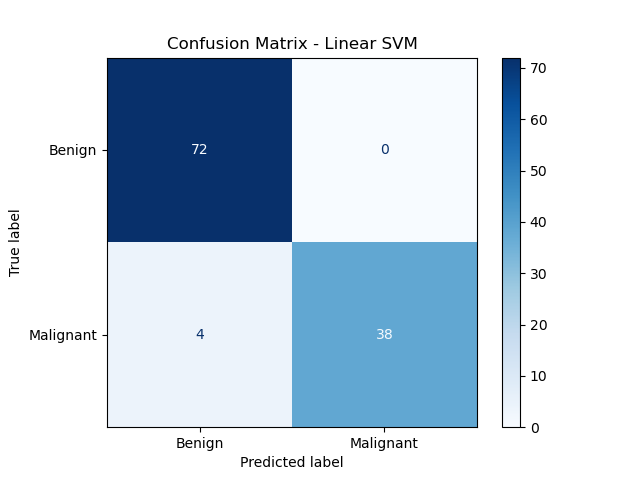
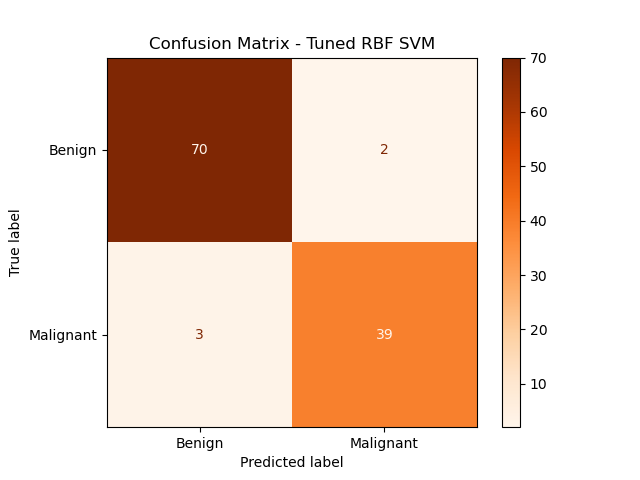
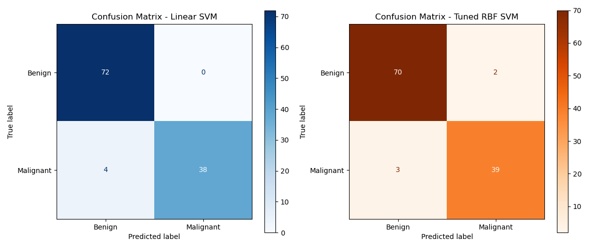
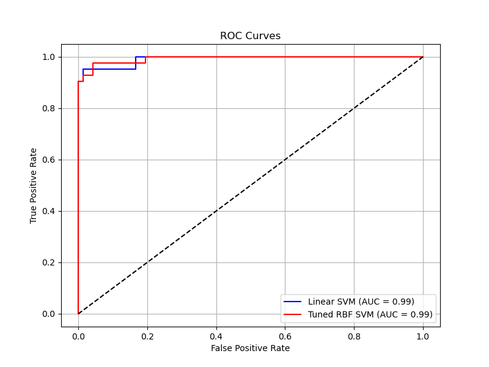
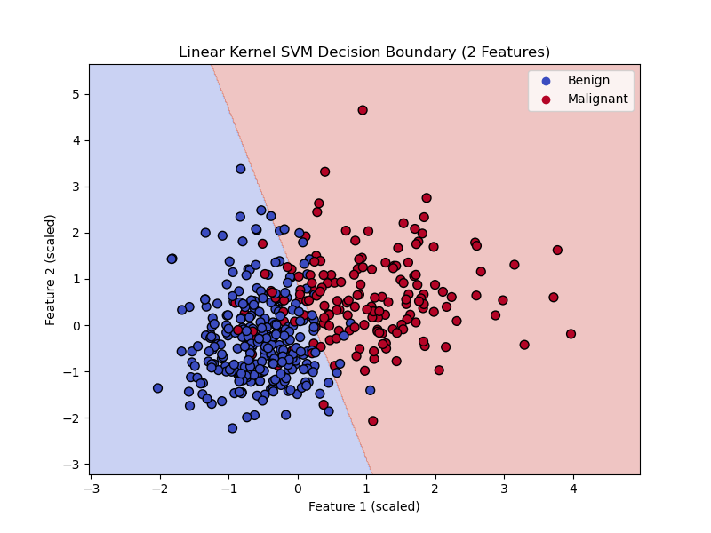
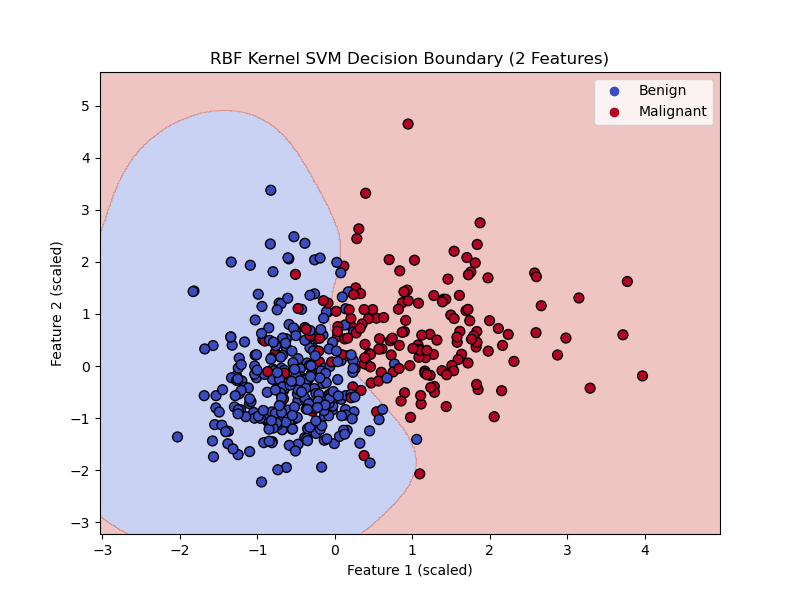

# ElevateLabs_AI-ML_TASK-07
Breast Cancer Classification using Support Vector Machine (SVM)
# 🔍 Breast Cancer Classification using SVM (Linear & RBF)

This project implements a **Support Vector Machine (SVM)**-based classifier to distinguish between **benign** and **malignant** breast tumors using the **Breast Cancer Wisconsin Diagnostic dataset**. We explore:

- Linear Kernel SVM
- RBF (Gaussian) Kernel SVM
- Hyperparameter tuning with GridSearchCV
- Performance comparison using classification reports, confusion matrices, ROC curves, and decision boundary visualizations.

---

## 📁 Dataset

- **Source**: [Breast Cancer Wisconsin Diagnostic Dataset - UCI](https://archive.ics.uci.edu/ml/datasets/Breast+Cancer+Wisconsin+(Diagnostic))
- **Features**: 30 numerical features computed from digitized images of a breast mass.
- **Target**:  
  - `0`: Benign  
  - `1`: Malignant

---

---

## 🧪 Model Overview & Results

### 🔹 Linear Kernel SVM Performance

| Metric     | Benign (0) | Malignant (1) |
|------------|------------|---------------|
| Precision  | 0.95       | 1.00          |
| Recall     | 1.00       | 0.90          |
| F1-Score   | 0.97       | 0.95          |
| Accuracy   | **0.96**   |               |

---

### 🔸 RBF Kernel SVM Performance

| Metric     | Benign (0) | Malignant (1) |
|------------|------------|---------------|
| Precision  | 0.96       | 1.00          |
| Recall     | 1.00       | 0.93          |
| F1-Score   | 0.98       | 0.96          |
| Accuracy   | **0.97**   |               |

---

### 🎯 Tuned RBF Kernel SVM (Using GridSearchCV)

- **Best Hyperparameters**: `{'C': 100, 'gamma': 0.01, 'kernel': 'rbf'}`
- **Best Cross-validation Score**: `0.9758`

| Metric     | Benign (0) | Malignant (1) |
|------------|------------|---------------|
| Precision  | 0.96       | 0.95          |
| Recall     | 0.97       | 0.93          |
| F1-Score   | 0.97       | 0.94          |
| Accuracy   | **0.96**   |               |

---

## 📊 Classification Metrics Comparison

| Class | Linear Precision | Linear Recall | Linear F1-Score | Linear Support | RBF Precision | RBF Recall | RBF F1-Score | RBF Support |
|-------|------------------|---------------|-----------------|----------------|----------------|-------------|---------------|-------------|
| 0     | 0.95             | 1.00          | 0.97            | 72             | 0.96           | 0.97        | 0.97          | 72          |
| 1     | 1.00             | 0.90          | 0.95            | 42             | 0.95           | 0.93        | 0.94          | 42          |

📁 [CSV Download](classification_metrics_comparison.csv)

---

## 📉 Visualizations

### 🔹 Confusion Matrices

**Linear SVM Confusion Matrix**

**Tuned RBF SVM Confusion Matrix**

**Side-by-Side Comparison**

---

### 🔸 ROC Curves

---

### 🔺 Decision Boundaries (2 Features Only)

To better visualize decision separation, only the **first two scaled features** were used.

**Linear SVM Decision Boundary**

**RBF SVM Decision Boundary**

---

## 📌 Key Insights

- **Linear SVM** performed well with 96% accuracy but struggled slightly with malignant (class 1) recall.
- **RBF SVM**, especially after tuning, showed better balance and robustness.
- Hyperparameter tuning improved precision-recall balance for class 1.

---

## 📚 Technologies Used

- Python
- scikit-learn
- pandas, numpy, matplotlib
- Jupyter Notebook

---

